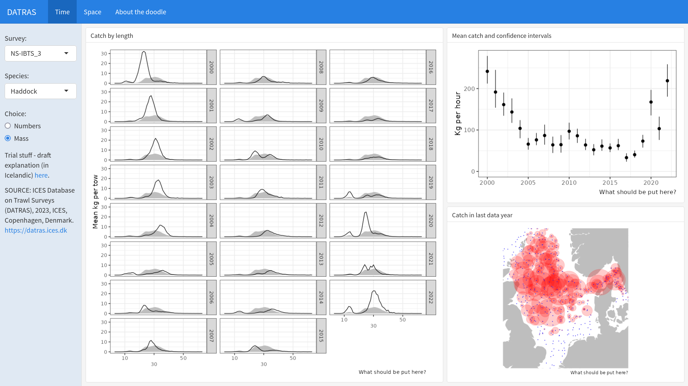
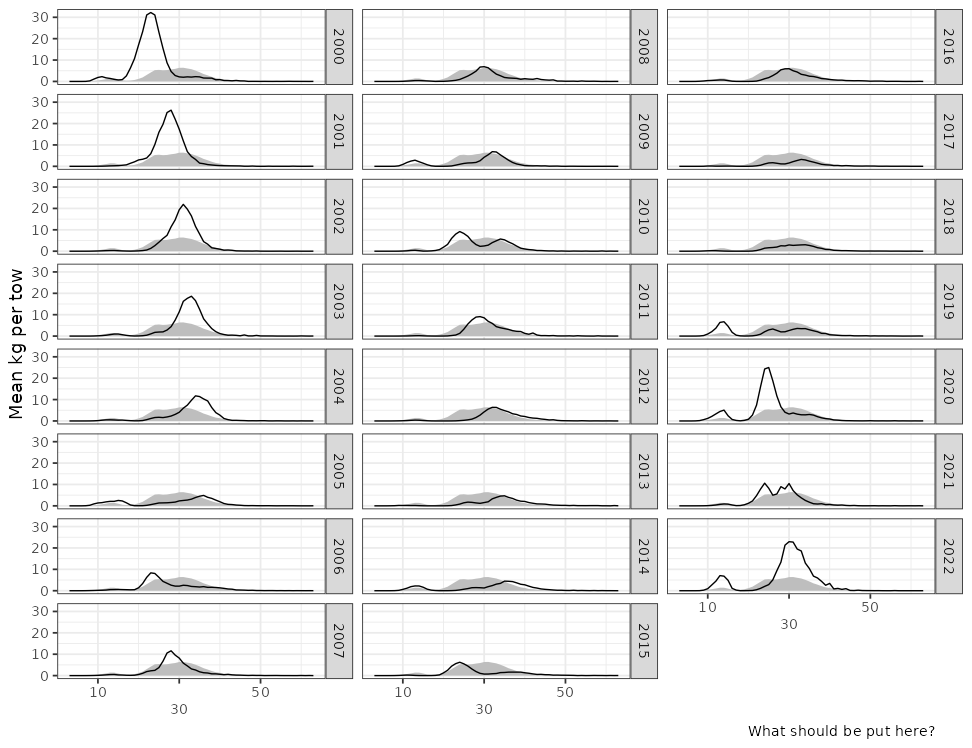
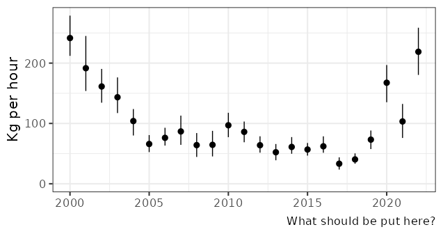
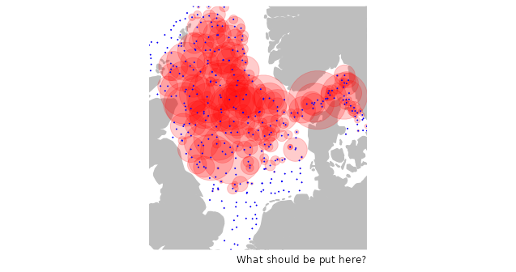
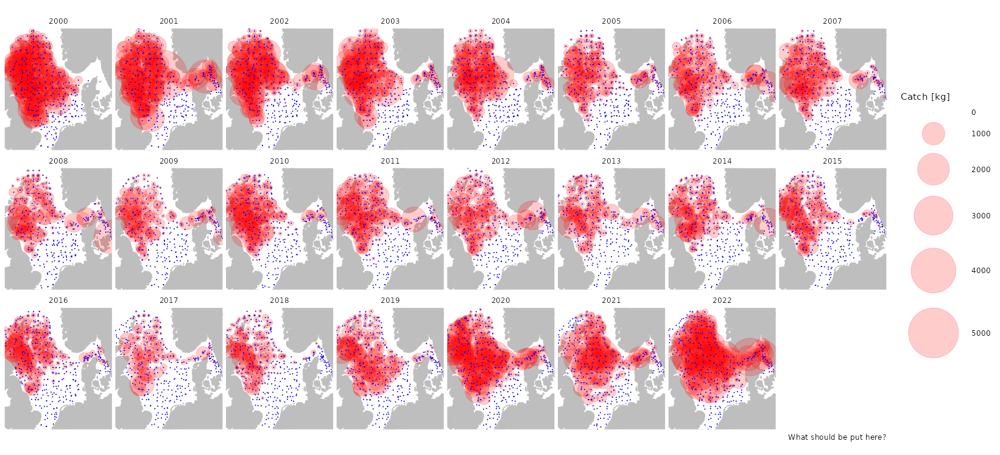
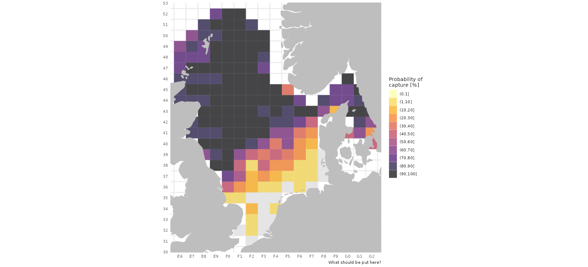

```{r, include = FALSE}
knitr::opts_chunk$set(
  echo = FALSE,
  message = FALSE, 
  warning = FALSE,
  collapse = TRUE,
  error = TRUE,
  comment = "#>"
)
```


```{r}

```

## Preamble

The intent of this guide is to explain the background of the various plots presented in order to enhance the users ability to extract information content from the dashboard. Below the haddock is used as a case example.

## User panel

The user panel is on the left side of the dashboard, were he can can select:

* The survey: Here two surveys are presented.
* The species: The species list shows species that are most persistently observed in any of the surveys.
* Display type: The user has a choice of getting metrics in the graphs expressed as number or mass (kg)

## Time

When the shiny starts the first page that appears is labelled, possibly quite wrongly "Time". It is comosed of three plot panels discussed below.

### Catch by length

The large left-panel on the first page.

The catch by length is often referred to as length frequency plot. Here each sub-panel represents the year that is indicated on the right side of each sub-panel. The x-axis is the length in centimeters and on the y-axis we have, dependent on the user choice either the mean number or kilogram caught in the survey.

The black line within each sub-panel represent the measurement in the year in question while shaded grey polygon represents the mean over all the years presented. The intent is that the grey line acts as a reference, so when the black line is above it we have higher than average value in a given year and vice versa.

For some of the species we have clear progression of weak and stong year classes going through the fisheries over time, at least in the smaller lenght groups. An example below is the haddock in the NS-IBTS quarter 3 survey. Here one e.g. observes a strong mode at around 17-18 cm in 2000, a strong 27-28 cm mode in 2001 and then further along time in 2002 to 2004. This most likely represents a relative strong 1999 year class that went both through the survey and the fisheries in the beginning of this century.

```{r}

```

What followed were relatively meager years, but by no means not important, but in the most recent years we are again seeing signs of relatively large recruitment.

The method used to derive the numbers where:

* All length measurements represented on the x-axis were rounded down to the nearest centimeter.
* The estimated number caught are just a simple sum of all the fish measured within a length class in a surevy year divided by the total number of hauls taken during that year.
* The biomass estimates were simply derived from assuming that the weight of each fish is a function of:

$$weight = 0.00001length^3$$
where the total mass in each length class was then that weight approximation for each individual muliplied by the number of fish measured in that length class.


### Mean catch and confidence interval

The top-right panel on the first page.

The graph shows the average catch per tow (the point) in any survey year. The vertical lines indicated the 95% confidence interval of the average catch.

```{r}

```

The example above shows mean catch (kg) per tow of the haddock. We observe relativey high catches of around 200 kg/tow in the beginning of the time series associated with the large year class of 1999 that we saw progressing in the length frequency plot example above. The catches decline over the next few years because the influence of that year class declines and following year classes being relative weaker. Over the next decade+ the survey catches are low. but in recent years we see a steep increase because a couple of strong year classes are entering into system, a reflection of what we already saw in the length frequency plot above.

### Catch in the last data year

The bottom-right panel on the first page.

This is a bubble plot of the catch per tow in the last survey data year available. The blue colours indicate the position of all the tows taken in the survey while the red bubbles are an indication of how much was caught at each station.

```{r}

```


The plot does not have any labels to indicate the value of what was caught, that is given in the next panel.

## Space

The Space panel is composed of three different plot panels:

### Catch per tow

A bubble plot of the catch per tow in eacy survey year (indicated in the top of each panel). The blue colours indicate the position of all the tows taken in the survey while the red bubbles are an indication of how much was caught at each station.

```{r}

```

The example above is again the haddock cpue in kilogrammes, showing quite a dense red set of bubbles in the start and end of the time series, again a reflection of big yearclasses in the system. It is of interest to observe that during the most meager years in-between (e.g. in 2018) that the catches seem mostly confined to the western part of the north-sea while in the eastern part hardly any haddock is observed.

### Probability of capture

The probabilty of capture (presented decadal % intervals) indicates the percent of tows within an ICES rectangle that a species was observed over all the survey years. The darker the colour the higher proportion of occurence of a species in question is observed in any tows within a rectangle.

Here no differnce is made between if only one or thousands of individuals were caught in a single tow. And hence, here the user choice when selecting "Number" or "Mass" make no difference.

```{r}

```

In the case example of haddock we see that haddock is almost always caught within the mid-western to north-eastern area and that towards the south-eastern direction haddock is observed less and less frequently. No haddock is caught in the survey along the continental shores of the North Sea proper, here marked as grey areas.

The intent of the probability of capture is to give an indication of the relative distribution of the species in question and is most informative when it comes to the more rarer species obsvered.

### Space time plot

... this may be a little too complicated to include in the dashboard. In short the plots show the number or mass developement within each ICES statistical rectangle.

... more will be added here if it is deemed Kosher to include


## Some additional methods notes

... pending